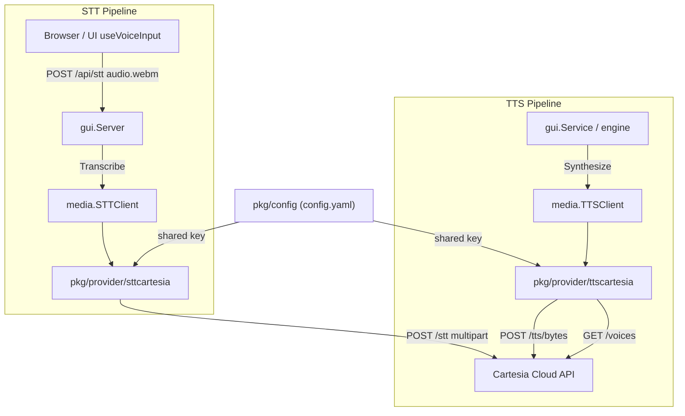

# Design Spec: Cartesia TTS and STT Provider

**Date:** 2026-10-02  
**Status:** Approved  
**Target Subsystems:** `pkg/provider/ttscartesia`, `pkg/provider/sttcartesia`, `pkg/provider`, `pkg/media`, `pkg/config`, `frontend`  
**Related Specs:** `docs/superpowers/specs/2026-09-22-elevenlabs-tts-provider-design.md`, `docs/superpowers/specs/2026-09-28-provider-key-identity-design.md`

---

## 1. Executive Summary

Cartesia provides real-time voice intelligence through high-performance text-to-speech (Sonic) and speech-to-text (Ink). This design integrates Cartesia as a first-class remote, metered provider in LocalRPG for both TTS and STT.

The integration uses:
- **TTS**: Cartesia Sonic 3.6 (`sonic-3.6`) via the batch audio streaming endpoint (`POST https://api.cartesia.ai/tts/bytes`), producing linear PCM WAV (`pcm_s16le`, 44.1kHz), dynamically mapped voice options (`model`, `emotion`, `language`), bracketed vocal cues (`[laughter]`), SSML pauses, and full voice catalog discovery (`GET https://api.cartesia.ai/voices`).
- **STT**: Cartesia Ink Whisper (`ink-whisper`) via the batch transcription endpoint (`POST https://api.cartesia.ai/stt`), accepting multipart audio file uploads (`audio/webm`, `audio/wav`, `audio/ogg`, etc.) directly from LocalRPG's recording pipeline.
- **Unified Credential Management**: A shared top-level provider credential (`providers.cartesia.api_key` and environment variable `CARTESIA_API_KEY`) that supplies keys to both TTS and STT automatically, with optional overrides in `media.tts.api_key` and `media.stt.api_key`.
- **API Versioning & Resilience**: Pinned `Cartesia-Version: 2026-08-14` header on all requests, structured Cartesia error parsing, and automated 429 retry handling respecting `Retry-After`.

---

## 2. Protocol & API Specification

### 2.1 API Conventions
* **Base URL**: `https://api.cartesia.ai` (HTTPS only).
* **API Version Header**: `Cartesia-Version: 2026-08-14` sent on every request.
* **Authentication**: `Authorization: Bearer <api_key>` using standard server keys (`sk_car_...`).
* **Error Response Format**: Structured JSON responses (for versions `>= 2026-03-01`):
  ```json
  {
    "error_code": "concurrency_limited",
    "title": "Too many concurrent requests",
    "message": "You have exceeded your plan's concurrency limit.",
    "request_id": "..."
  }
  ```

### 2.2 Text-to-Speech (TTS)
* **Endpoint**: `POST https://api.cartesia.ai/tts/bytes`
* **Default Model**: `sonic-3.6` (fallback/options: `sonic-3.5`, `sonic-3`).
* **Default Voice**: `db6b0ed5-d5d3-463d-ae85-518a07d3c2b4` (Skylar, `en-US` Female).
* **Request Payload**:
  ```json
  {
    "model_id": "sonic-3.6",
    "transcript": "Hello adventurer! What brings you to the tavern tonight?",
    "voice": {
      "id": "db6b0ed5-d5d3-463d-ae85-518a07d3c2b4"
    },
    "output_format": {
      "container": "wav",
      "encoding": "pcm_s16le",
      "sample_rate": 44100
    },
    "generation_config": {
      "speed": 1.0,
      "volume": 1.0,
      "emotion": "neutral"
    },
    "language": "en"
  }
  ```
* **Audio Format**: Clean WAV container (`pcm_s16le` at 44.1kHz). LocalRPG's audio pipeline normalises incoming audio bytes to Ogg/Opus for local caching and playback.
* **Generation Controls**:
  * `generation_config.speed`: Double in `[0.6, 1.5]`. Maps from `voice.SpeechRate` when set away from 1.0.
  * `generation_config.volume`: Double in `[0.5, 2.0]`. Defaults to 1.0.
  * `generation_config.emotion`: Supported emotions include `neutral`, `calm`, `angry`, `content`, `sad`, `scared`, `happy`, `excited`, `curious`, `sympathetic`.
* **Speech Cues & SSML**:
  * Inline bracketed tags: `[laughter]` triggers natural laughing phonemes.
  * SSML tags supported: `<break time="1s"/>`, `<emotion value="excited"/>`.
* **Metering & Cost**:
  * Billed at approximately 1 credit per character synthesized.
  * Implements `media.MeteredProvider`; reports `Characters: len([]rune(text))` and `Requests: 1` via `LastUsage()`.

### 2.3 Voice Catalog
* **Endpoint**: `GET https://api.cartesia.ai/voices?limit=100&expand[]=preview_file_url`
* **Pagination**: Cursor-based using `starting_after=<next_page>` while `has_more == true` and `next_page != ""`.
* **Response Item Mapping**:
  ```json
  {
    "id": "db6b0ed5-d5d3-463d-ae85-518a07d3c2b4",
    "name": "Skylar",
    "tagline": "Friendly Guide",
    "description": "Approachable American female ideal for customer care and support.",
    "gender": "feminine",
    "language": "en",
    "accents": [
      { "accent": "general-american", "locale": "en-US", "is_native": true }
    ],
    "preview_file_url": "https://api.cartesia.ai/..."
  }
  ```
  * `ID`: voice ID (UUID string).
  * `Name`: voice display name.
  * `Gender`: normalised to `"female"` (`feminine`), `"male"` (`masculine`), or `"neutral"` (`gender_neutral`).
  * `Description`: `tagline` + `: ` + `description`.
  * `Language`: `accents[0].locale` or `language`.
  * `PreviewURL`: `preview_file_url`.
  * `Tags`: normalised accents, gender, and category.

### 2.4 Speech-to-Text (STT)
* **Endpoint**: `POST https://api.cartesia.ai/stt`
* **Transport**: `multipart/form-data`
* **Default Model**: `ink-whisper`
* **Form Fields**:
  * `model`: `"ink-whisper"` (or configured model).
  * `file`: audio bytes named `audio.webm` (Cartesia accepts WebM, WAV, MP3, Ogg, FLAC).
  * `language`: optional ISO-639-1 language code (e.g. `"en"`).
* **Response Payload**:
  ```json
  {
    "type": "transcript",
    "request_id": "...",
    "text": "Open the heavy wooden door.",
    "language": "en",
    "duration": 2.5
  }
  ```
* **Metering & Cost**:
  * Billed at 1 credit per 2 seconds of audio.
  * Implements `media.MeteredProvider`; reports audio duration and `Requests: 1` via `LastUsage()`.

---

## 3. Architecture & Components



### 3.1 Registry & Canonical Keys
* `pkg/provider/keys.go`:
  * `KeyTTSCartesia Key = "tts:cartesia"`
  * `KeySTTCartesia Key = "stt:cartesia"`
  * Added to `AllKeys()`.
* `pkg/media/exports.go`:
  * `TTSKeyFor`: matches `cfg.Type == "cartesia"` and `cfg.Type == "builtin" && cfg.BuiltinName == "cartesia"`.
  * `STTKeyFor`: matches `cfg.Type == "cartesia"` and `cfg.Type == "builtin" && cfg.BuiltinName == "cartesia"`.

### 3.2 Provider Package: `pkg/provider/ttscartesia`
* `ttscartesia.go`:
  * `init()` registers `tts:cartesia` in `provider.Register`.
  * Descriptor:
    * `ID`: `"tts:cartesia"`
    * `Family`: `provider.FamilyTTS`
    * `Label`: `"Cartesia Sonic (Cloud, metered)"`
    * `Description`: `"Ultra-fast streaming neural voice synthesis via Cartesia Sonic."`
    * `Source`: `"builtin"`
    * `Features`: `FeatureMetered`, `FeatureKeyRequired`, `FeatureVoiceCatalog`, `FeatureVoiceOptions`, `FeatureSpeechCues`.
    * `Presets`: `Preset{ID: "cartesia", Label: "Cartesia Sonic (Cloud, metered)", Order: 8, Config: { ... }}`.
* `client.go`:
  * Implements:
    * `media.TTSClient`: `Synthesize(ctx, text, voice)`
    * `media.VoiceCatalog`: `ListVoices(ctx)`
    * `media.VoiceOptions`: `VoiceOptions() []media.VoiceOption`
    * `media.SpeechCueCapabilities`: `SpeechCueCapabilities() media.SpeechCueCapabilities`
    * `media.MeteredProvider`: `Metered() bool`, `LastUsage() media.Usage`
    * `SetLogger(trace.Logger)`
* `client_test.go`:
  * Mock HTTP server tests for synthesis, catalog pagination, rate limit backoff, usage tracking, and error parsing.

### 3.3 Provider Package: `pkg/provider/sttcartesia`
* `sttcartesia.go`:
  * `init()` registers `stt:cartesia` in `provider.Register`.
  * Descriptor:
    * `ID`: `"stt:cartesia"`
    * `Family`: `provider.FamilySTT`
    * `Label`: `"Cartesia Ink (Cloud, metered)"`
    * `Description`: `"Accurate cloud speech transcription via Cartesia Ink Whisper."`
    * `Source`: `"builtin"`
    * `Features`: `FeatureMetered`, `FeatureKeyRequired`.
    * `Presets`: `Preset{ID: "cartesia", Label: "Cartesia Ink (Cloud, metered)", Order: 4, Config: { ... }}`.
* `client.go`:
  * Implements:
    * `media.STTClient`: `Transcribe(ctx, audioData)`
    * `media.MeteredProvider`: `Metered() bool`, `LastUsage() media.Usage`
* `client_test.go`:
  * Mock HTTP server tests for multipart upload, format parsing, usage recording, and error decoding.

### 3.4 Configuration Updates
* `pkg/config/types.go`:
  * Add `Cartesia CartesiaProviderConfig` to `ProvidersConfig`:
    ```go
    type CartesiaProviderConfig struct {
        APIKey string `yaml:"api_key,omitempty" json:"api_key,omitempty"`
    }
    ```
* `pkg/config/presets.go`:
  * Add `TTSPresets["cartesia"]`:
    ```go
    "cartesia": {
        Type: "builtin",
        BuiltinName: "cartesia",
        Model: "sonic-3.6",
        DefaultVoice: "db6b0ed5-d5d3-463d-ae85-518a07d3c2b4",
        Pitch: 1.0,
        SpeechRate: 1.0,
        MasterVolume: 1.0,
    }
    ```
  * Add `STTPresets["cartesia"]`:
    ```go
    "cartesia": {
        Type: "builtin",
        BuiltinName: "cartesia",
        Model: "ink-whisper",
    }
    ```

---

## 4. Frontend Integration

### 4.1 Settings Studio (`frontend/src/components/SettingsStudio.tsx`)
1. **Providers Tab**:
   * Add Cartesia API Key input under Provider Credentials:
     * Label: `"Cartesia API Key"`
     * Bound to `config.providers.cartesia.api_key`.
     * Helper text: `"Shared key used for Cartesia Sonic TTS and Ink STT. Alternatively, set CARTESIA_API_KEY in your environment."`
2. **Text-to-Speech Settings**:
   * Dropdown option: `<option value="builtin:cartesia">Built-in: Cartesia Sonic (Cloud, metered)</option>`.
   * When selected, initializes `builtin_name: "cartesia"`, `model: "sonic-3.6"`, `default_voice: "db6b0ed5-d5d3-463d-ae85-518a07d3c2b4"`.
   * Voice Tunables: VoiceOptions drawer displays `model`, `emotion`, and `language` selectors.
3. **Speech-to-Text Settings**:
   * Dropdown option: `<option value="builtin:cartesia">Built-in: Cartesia Ink (Cloud, metered)</option>`.
   * When selected, initializes `builtin_name: "cartesia"`, `model: "ink-whisper"`.
   * "Test STT Connection" button transcribes a test sample using Cartesia.

---

## 5. Security & Error Handling

* **Credential Redaction**:
  * On client instantiation, call `trace.RegisterSecret(apiKey)` to ensure API keys are masked in logs, diagnostics, and traces.
* **Structured Error Parsing**:
  * Cartesia returns structured error JSON on failures (`error_code`, `title`, `message`).
  * Decoder extracts human-readable message without dumping full raw payload.
  * Special HTTP code translations:
    * `401 Unauthorized`: `"cartesia rejected the API key; check media.tts.api_key or CARTESIA_API_KEY"`
    * `402 Payment Required` / `429 Too Many Requests`: `"cartesia quota or rate limit reached; check your plan and credits"`
    * `400 Bad Request`: `"cartesia: <message>"`
* **Rate-Limit Retry**:
  * If Cartesia responds with HTTP 429 and provides a `Retry-After` header, sleep for the indicated duration (or default 1s) and retry once.

---

## 6. Verification & Test Plan

1. **Drift Guard Checks**:
   * `pkg/provider/all/all_test.go`:
     * `TestTTSDescriptorsBuildAndFeaturesAreBacked`: automatically verifies `tts:cartesia` builds and matches all advertised features (`FeatureVoiceCatalog`, `FeatureVoiceOptions`, `FeatureSpeechCues`, `FeatureMetered`, `FeatureKeyRequired`).
     * `TestSTTDescriptorsBuildAndFeaturesAreBacked`: verifies `stt:cartesia` builds and advertises valid features.
2. **Unit Tests**:
   * `pkg/provider/ttscartesia/client_test.go`:
     * Synthesis payload formatting, WAV binary reception, voice speed clamping, emotion option mapping.
     * Voice catalog paging with `starting_after`, gender mapping, preview URL extraction.
     * Rate-limiting retry with mock 429 followed by 200 OK.
     * Structured error response handling.
     * Usage meter character count verification.
   * `pkg/provider/sttcartesia/client_test.go`:
     * Multipart audio upload format, model field assertion, transcript JSON decode.
     * Usage meter duration verification.
     * Rate-limiting and error handling.
   * `pkg/media/key_test.go`:
     * Assert `TTSKeyFor` and `STTKeyFor` map both `type: "cartesia"` and `type: "builtin", builtin_name: "cartesia"` to `tts:cartesia` and `stt:cartesia`.
   * `pkg/config/types_test.go`:
     * Verify YAML and JSON roundtripping for `ProvidersConfig.Cartesia` and presets.
3. **Documentation Catalog**:
   * Run `go test ./pkg/gui -update-docs` to update the embedded provider catalog and verify markdown generation.
4. **Frontend Gate**:
   * Run `mise run test:frontend` (`npx tsc --noEmit`) to verify zero TypeScript errors.

---

## 7. File Map

| Action | Path | Description |
|---|---|---|
| **Create** | `pkg/provider/ttscartesia/ttscartesia.go` | Provider descriptor, presets, and `init()` registration for `tts:cartesia` |
| **Create** | `pkg/provider/ttscartesia/client.go` | Cartesia TTS client (`TTSClient`, `VoiceCatalog`, `VoiceOptions`, `SpeechCueCapabilities`, `MeteredProvider`) |
| **Create** | `pkg/provider/ttscartesia/client_test.go` | Unit tests for Cartesia TTS synthesis, catalog, errors, usage |
| **Create** | `pkg/provider/sttcartesia/sttcartesia.go` | Provider descriptor, presets, and `init()` registration for `stt:cartesia` |
| **Create** | `pkg/provider/sttcartesia/client.go` | Cartesia STT client (`STTClient`, `MeteredProvider`) |
| **Create** | `pkg/provider/sttcartesia/client_test.go` | Unit tests for Cartesia STT transcription, errors, usage |
| **Modify** | `pkg/provider/keys.go` | Add `KeyTTSCartesia`, `KeySTTCartesia`, update `AllKeys()` |
| **Modify** | `pkg/provider/all/all.go` | Blank-import `ttscartesia` and `sttcartesia` |
| **Modify** | `pkg/provider/all/all_test.go` | Add STT capability tests if needed and verify TTS drift guard |
| **Modify** | `pkg/config/types.go` | Add `CartesiaProviderConfig` to `ProvidersConfig` |
| **Modify** | `pkg/config/presets.go` | Add `cartesia` presets to `TTSPresets` and `STTPresets` |
| **Modify** | `pkg/media/exports.go` | Map `cartesia` in `TTSKeyFor` and `STTKeyFor`, wire payload `BuildTTS` / `BuildSTT` |
| **Modify** | `pkg/media/catalog.go` | Add `cartesia` key detection to `KeyPresentWithSharedKey` |
| **Modify** | `pkg/media/key_test.go` | Add tests for `tts:cartesia` and `stt:cartesia` key resolution |
| **Modify** | `frontend/src/types.ts` | Add `cartesia` to `ProvidersConfig` and provider family types if needed |
| **Modify** | `frontend/src/components/SettingsStudio.tsx` | Add Cartesia provider options, credential input, and defaults |
