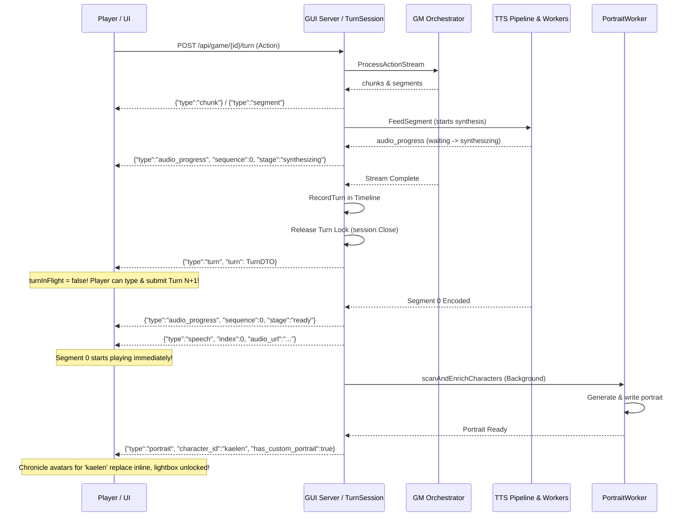

# Turn Audio, Persona Attribution, Portrait Pipeline & GUI Polish Design

**Date:** 2026-10-03  
**Status:** Proposed  
**Scope:** Turn interactivity, streaming audio pipeline, sequential playback queue, persona gender & voice assignment, background portrait generation & reactive chronicle replacement, Wails v3 text selection & clipboard.  
**Related:** `2026-10-03-progressive-turn-stream-design.md`, `2026-10-04-grouped-live-audio-design.md`, `pkg/gui/service.go`, `pkg/gui/streaming_tts.go`, `pkg/harness/extractor.go`, `pkg/engine/portrait_worker.go`, `cmd/localrpg/gui.go`

---

## 1. Overview & Problem Statement

Several usability frictions and presentation gaps exist in the turn completion and asset generation flows:

1. **Non-Interactive Delay During Audio Generation:** When a turn response finishes generating text, the user experiences a noticeable freeze where input and interactions are blocked while waiting for TTS audio to synthesize. `TurnSession.Run` synchronously waits on `streamer.Close()` before closing the HTTP response, and the frontend keeps `turnInFlight = true` until the stream finishes, disabling all interaction. Furthermore, if a user takes a new action, cross-turn audio playback is not queued.
2. **Lack of Audio Progress Feedback:** Users have no visibility into how many audio beats are queued, whether segments are currently being received from the provider or encoded to cache, and what sequence number is active.
3. **Delayed Audio Playback:** Rather than waiting for the entire batch of clips before playing, audio can begin playback as soon as the first sequence beat is available and stream progressively beat-by-beat.
4. **Gender-Mismatched Voice Profile Assignment:** Newly introduced characters frequently receive opposite-gender voices (e.g., male characters assigned female voices). This occurs because `AssignVoiceProfile` ignores `ent.Gender`, tag scoring matches non-gendered tags (e.g. "young"), and deterministic hash fallbacks pick uniformly from the entire voice list without gender gating.
5. **Static Placeholder Portraits for New Characters:** When characters are introduced, their portraits should be generated in the background. While generating, a placeholder is displayed; but once generation completes, all occurrences in the chronicle should update inline to the real portrait without requiring a manual refresh.
6. **Placeholder Portraits Open Empty Lightbox:** Clicking on procedural SVG placeholder portraits in the chronicle currently opens the lightbox modal with an empty/broken view. Placeholder portraits should not be zoomable.
7. **No Text Selection or Copy/Paste in Wails Desktop GUI:** In the desktop app, text in documentation, error banners, and prose cannot be highlighted, selected, or copied to clipboard via standard OS shortcuts (`Ctrl+C` / `Cmd+C`) or context menus.

---

## 2. Goals & Non-Goals

### Goals
- Release turn interactivity immediately upon GM text completion, allowing the player to compose and submit subsequent actions without waiting for TTS.
- Queue audio playback across consecutive turns: submitting Turn $N+1$ while Turn $N$ audio is still rendering or playing plays Turn $N$'s remaining audio before starting Turn $N+1$'s audio.
- Emit granular audio progress events (`waiting`, `synthesizing`, `encoding`, `ready`, `failed`) and display progress in both the action console and individual chronicle segment cards.
- Play in strict sequence order, starting playback immediately once sequence item #0 is ready, pausing only if the next sequential beat is still in flight.
- Enforce strict gender gating in voice profile assignment, ensuring male characters receive male voices, female characters receive female voices, and neutral/unspecified characters receive appropriate profiles.
- Trigger background portrait generation for introduced characters, notifying the frontend when ready and reactively replacing placeholders across the chronicle in-place.
- Disable lightbox zoom on placeholder portraits, enabling it only when a real custom portrait exists.
- Enable full text selection, OS clipboard shortcuts (`Ctrl+C`, `Ctrl+V`, `Ctrl+A`), and native context menus in the Wails v3 desktop GUI.

### Non-Goals
- Altering stored turn history format in `history.jsonl`.
- Full-duplex WebSocket protocol replacement (we retain the lightweight NDJSON streaming protocol).
- Regenerating portraits or reassigning voices for pre-existing campaign characters retroactively unless explicitly edited or requested.

---

## 3. Non-Blocking Turn Interactivity & Cross-Turn Audio Queueing

### 3.1 Turn Lock & Interactivity Decoupling
- In `pkg/gui/service.go:TurnSession.Run`:
  - When GM text generation completes and the turn is recorded by `Timeline`, `announce(TurnEvent{Type: "turn", Turn: &dto})` is emitted.
  - Immediately following turn emission, the campaign lock is released (`t.release()`, setting `t.release = nil`).
  - `streamer.Close()` no longer blocks the return of `TurnSession.Run` or the execution of subsequent turns; worker drainage runs concurrently in the background if the turn finishes.
- In `frontend/src/App.tsx`:
  - On `event.type === 'turn'`, set `turnInFlight = false` immediately (re-enabling the action input console, buttons, and drawers).
  - The NDJSON reader continues listening for incoming `audio_progress`, `speech`, and `portrait` events for that turn until the stream closes.

### 3.2 Cross-Turn Audio Queue Coordination
- **Backend Application Playback (`pkg/media/playback/player.go`):**
  - Generalize `Player.PlayQueue` or introduce `Player.EnqueueQueue(clips <-chan string)` so that submitting a new turn while an existing queue is playing does not cancel the current stream.
  - Instead, the new turn's clip channel is appended to a queue of channels, draining Turn $N$ fully before advancing to Turn $N+1$.
- **Frontend Browser Playback (`useStreamedSpeech` & `useSegmentPlayback`):**
  - Implement an `AudioQueueCoordinator` shared across turns.
  - When Turn $N+1$ produces clips while Turn $N$ is still speaking, Turn $N+1$'s clips are enqueued at the tail of the audio queue rather than interrupting or dropping.
  - `StopAudio` explicitly clears the entire coordinator queue across all turns.

---

## 4. Audio Progress Feedback & Eager Sequential Playback

### 4.1 Wire Event: `audio_progress`
The server emits progressive audio status events as segments move through the TTS pipeline:
```json
{
  "type": "audio_progress",
  "turn_number": 12,
  "sequence": 0,
  "total_segments": 4,
  "stage": "synthesizing", // "waiting" | "synthesizing" | "encoding" | "ready" | "failed"
  "ready_count": 0,
  "audio_key": "abc123...",
  "audio_url": "/api/audio/clip/abc123..."
}
```

### 4.2 Streamer Pipeline Stages
In `pkg/gui/streaming_tts.go`:
- **waiting**: Job enqueued, waiting for worker availability.
- **synthesizing**: TTS provider HTTP/model request active.
- **encoding**: Audio data returned from provider, encoding to Opus cache file.
- **ready**: Audio file written and indexed in cache; ready for immediate playback.
- **failed**: Provider or encode error; logged, segment marked failed so playback can gracefully skip.

### 4.3 UI Presentation
- **Action Console Status Badge:** A sleek status pill in the action input bar displaying overall turn audio status (e.g. `Audio: 2/4 ready (synthesizing #3)`).
- **Inline Segment Cards:** Each speech and narration bubble in `TurnSegments.tsx` displays a discreet status state when audio is active (`waiting` $\rightarrow$ `synthesizing` $\rightarrow$ `encoding` $\rightarrow$ `ready`).
- **Eager Playback:** Playback of segment #0 begins immediately when segment #0 hits `ready`. While playing, subsequent segments finish rendering. If the next segment is ready when the prior finishes, playback continues seamlessly; if still rendering, playback waits at the boundary.

---

## 5. Strict Character Gender & Voice Profile Assignment

### 5.1 Persona & Entity Gender Attributes
- In `pkg/turnstream/parser.go`, update `declarePersona` to decode full persona attributes (`gender`, `pronouns`, `role_tags`, `voice_hint`, `description`) rather than just name.
- In `pkg/engine/roster.go`, store persona attributes on declaration and seed gender.
- In `pkg/engine/timeline.go:stageEntities`: Ensure `ent.Gender = persona.Gender` is assigned directly to the entity struct (in addition to `ent.State.Set("gender", ...)`).
- In prompt instructions (`pkg/harness/context.go`): Explicitly mandate that `@persona` includes `gender` (`"male"`, `"female"`, `"neutral"`, or `"non-binary"`) and pronouns.

### 5.2 Strict Gender Gating in `AssignVoiceProfile`
In `pkg/harness/extractor.go:AssignVoiceProfile`:
1. Determine effective character gender:
   - Check `ent.Gender`.
   - If empty, check `ent.State.Get("gender")`.
   - If still empty, apply heuristic pronoun inference from `ent.Body`, `ent.Appearance`, and pronouns (e.g. `he/him/his` $\rightarrow$ male, `she/her/hers` $\rightarrow$ female).
2. Filter candidate voice profiles:
   - If gender is `male`: filter to profiles containing `"male"` tag and NOT `"female"`.
   - If gender is `female`: filter to profiles containing `"female"` tag and NOT `"male"`.
   - If gender is `neutral`, `non-binary`, or undetermined: allow all profiles, prioritizing neutral tags if present.
   - If the filtered set is empty (e.g. no male profiles configured in catalog), log a warning and fall back to all profiles.
3. Candidate Selection:
   - Profile ID direct match, tag scoring, and deterministic hash fallback (`idx := int(h.Sum32()) % len(genderFilteredProfiles)`) run strictly within the filtered candidate set.

---

## 6. Background Portrait Generation & Reactive Chronicle Replacement

### 6.1 Generation Trigger & Worker
- `scanAndEnrichCharacters` runs in the background when a turn completes.
- For newly introduced characters without a portrait, `PortraitWorker.Enqueue` is called.
- When `PortraitWorker.writePortrait` succeeds:
  - Writes the image to `assets/portraits/{id}.png`.
  - Updates the character markdown file with `portrait: assets/portraits/{id}.png`.
  - Re-syncs the entity in SQLite storage.
  - Calls a notification callback: `s.notifyPortraitReady(gameID, characterID, relPath)`.

### 6.2 Wire Event: `portrait`
When a portrait is generated, an event is emitted to the active turn stream (or stored in the game's active session):
```json
{
  "type": "portrait",
  "character_id": "kaelen",
  "portrait_url": "/api/game/my-game/character/kaelen/portrait?t=1727960000",
  "has_custom_portrait": true
}
```

### 6.3 DTO & Frontend Lightbox Handling
- In `SegmentDTO`, add `HasCustomPortrait bool` (`json:"has_custom_portrait"`).
  - True if the character's entity note has a non-empty `Portrait` that exists on disk.
  - False for procedural SVG fallbacks.
- In `frontend/src/App.tsx`:
  - Maintain a reactive `characterPortraits: Record<string, { url: string; hasCustom: boolean }>` in state.
  - On `event.type === 'portrait'`, update `characterPortraits[event.character_id] = { url: event.portrait_url, hasCustom: true }`.
- In `TurnSegments.tsx`:
  - Speech bubbles resolve their portrait via `characterPortraits[segment.speaker_id] ?? { url: segment.portrait_url, hasCustom: segment.has_custom_portrait }`.
  - When `hasCustom` is `false`:
    - Display the placeholder avatar.
    - Remove `cursor-zoom-in` styling.
    - Do not attach `onClick={() => openLightbox(...)}`.
  - When `hasCustom` is `true`:
    - Display the generated/custom portrait.
    - Add `cursor-zoom-in` and attach `openLightbox(...)`.
    - Updates occur reactively across all turns in the chronicle simultaneously.

---

## 7. Wails Desktop App Text Selection & Clipboard Support

### 7.1 Wails Application Menu & Accelerators
In `cmd/localrpg/gui.go`:
- Create and set the default application menu on the Wails app:
  ```go
  app.Menu.Set(application.DefaultApplicationMenu())
  ```
- On `application.WebviewWindowOptions`:
  ```go
  UseApplicationMenu:          true,
  DefaultContextMenuDisabled:  false,
  ```
- This registers native system menus for Edit (Undo, Redo, Cut, Copy, Paste, Select All) and binds the OS-level key combinations (`Ctrl+C`, `Ctrl+V`, `Ctrl+A`, `Cmd+C`, `Cmd+V`, `Cmd+A`).
- Enables the default webview right-click context menu offering Copy, Select All, and Inspect Element.

### 7.2 CSS Selection Clean-up
- Remove top-level `select-none` from:
  - `LauncherHub.tsx` root container
  - `StoryTheater.tsx` root container
  - `SystemsStudio.tsx` root container
  - `WorldsStudio.tsx` root container
  - `CampaignGallery.tsx`, `WorldGallery.tsx` root containers
- Restrict `select-none` specifically to buttons, icons, drag handles, and navigation chrome.
- Add explicit `select-text` utility class to:
  - `MarkdownDocViewer.tsx` (all documentation article bodies)
  - `DocsModal.tsx`
  - `DebugPanel.tsx` (logs and trace inspection)
  - Error banners in `App.tsx` and modal alert dialogs
  - `MarkdownProse.tsx` (chronicle narrative paragraphs and dialogue quotes)

---

## 8. Data Flow & Wire Protocols



---

## 9. Error Handling & Edge Cases

1. **TTS Segment Failure:** If a provider fails to synthesize a segment, an `audio_progress` event with `stage: "failed"` is emitted. The sequencer skips the failed segment and advances to the next available segment, preventing playback deadlocks.
2. **Turn N+1 Submitted During Turn N Audio:** Turn N+1 executes immediately without 409 Conflict. Its audio jobs are enqueued after Turn N's jobs in the playback pipeline.
3. **Missing Gender Tag:** If `@persona` or entity notes omit gender, heuristic pronoun inference detects gender. If neither is available, all profiles are eligible.
4. **Portrait Generation Failure or Disablement:** If image generation fails, times out, or image generation is disabled, no `portrait` event is emitted. The segment retains `has_custom_portrait: false`, the procedural SVG remains displayed, and lightbox zoom remains disabled.
5. **Headless / Socket Mode:** In headless or Unix domain socket mode, Wails window menus are bypassed and standard web client behavior is preserved.

---

## 10. Testing Strategy

1. **Backend Unit & Integration Tests:**
   - `pkg/harness/extractor_test.go`:
     - Test that male characters (`ent.Gender = "male"`) are strictly assigned male voice profiles.
     - Test that female characters (`ent.Gender = "female"`) are strictly assigned female voice profiles.
     - Test pronoun inference fallback (`he/him` vs `she/her`).
   - `pkg/gui/streaming_tts_test.go`:
     - Test that `audio_progress` events are emitted in proper stage order (`waiting` $\rightarrow$ `synthesizing` $\rightarrow$ `encoding` $\rightarrow$ `ready`).
     - Test sequential playback emission starting on sequence 0.
   - `pkg/gui/turn_test.go`:
     - Verify `TurnSession` releases campaign lock immediately upon turn event emission.
     - Test submitting two consecutive turns without 409 Conflict while audio is still rendering.
   - `pkg/engine/portrait_worker_test.go`:
     - Test notification callback when portrait completes and updates entity record.
2. **Frontend Component & Type Tests:**
   - `TurnSegments.test.tsx` / `tsc --noEmit`:
     - Verify lightbox click is disabled when `has_custom_portrait` is false.
     - Verify lightbox click is enabled when `has_custom_portrait` is true.
     - Verify reactive portrait replacement updates image sources for matching `speaker_id`.
   - `App.test.tsx`:
     - Verify `turnInFlight` drops to `false` upon receiving the `turn` event.
3. **E2E / CLI Verification:**
   - Run `mise run test:backend` and `mise run test:frontend`.
   - Build desktop binary with `mise run build` and verify text selection, copy/paste shortcuts, and context menu in Wails GUI.
